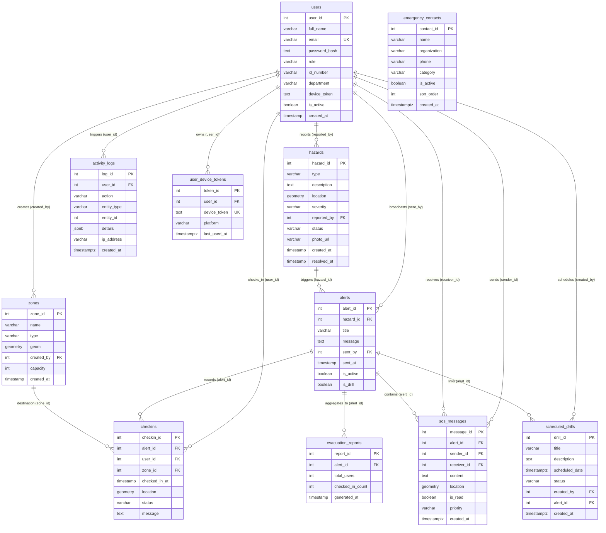

# SafeRoute — Database & Network Technical Documentation
**System**: Campus Evacuation & Safety Management System  
**Target Institution**: Polonoling National High School (Barangay Polonoling, Tupi, South Cotabato)  
**Coordinates**: `6.3615° N, 124.9502° E`  
**Document Version**: 1.0 (Comprehensive Technical Specification)  

---

## Talaan ng Nilalaman (Table of Contents)
1. [Entity-Relationship Diagram (ERD)](#1-entity-relationship-diagram-erd)
2. [Database Design (Disenyo ng Database)](#2-database-design-disenyo-ng-database)
3. [Database Dictionary (Data Dictionary / Data Catalog)](#3-database-dictionary-data-dictionary--data-catalog)
4. [Network Topology (Topolohiya ng Network)](#4-network-topology-topolohiya-ng-network)
5. [Network Design (Disenyo ng Network)](#5-network-design-disenyo-ng-network)
6. [Network Model (OSI & TCP/IP Model Mapping at Data Flow)](#6-network-model-osi--tcpip-model-mapping-at-data-flow)

---

# 1. Entity-Relationship Diagram (ERD)

Ang database ng SafeRoute ay binubuo ng **11 tables** na pinapagana ng **PostgreSQL 14+** na may **PostGIS** extension upang mapangasiwaan ang mga GPS geospatial geometries (Point at Polygon).



---

# 2. Database Design (Disenyo ng Database)

### A. DBMS & Spatial Engine
* **Database Engine**: PostgreSQL 14+
* **Spatial Extension**: **PostGIS** (`CREATE EXTENSION IF NOT EXISTS postgis;`)
* **Spatial Reference System Identifier (SRID)**: **WGS 84 / EPSG:4326** (Standard GPS Latitude at Longitude).
  * `GEOMETRY(Point, 4326)`: Ginagamit sa `hazards.location`, `checkins.location`, at `sos_messages.location`.
  * `GEOMETRY(Polygon, 4326)`: Ginagamit sa `zones.geom` para i-represent ang polygons ng Polonoling NHS buildings, athletic oval, at open evacuation grounds.

### B. Normalization Analysis (Third Normal Form - 3NF)
1. **1NF (First Normal Form)**: Lahat ng column attributes ay atomic; walang repeating groups o arrays sa relational columns. Ang multi-device tokens ay inihiwalay sa `user_device_tokens` table para sa 1-to-many relationship.
2. **2NF (Second Normal Form)**: Lahat ng tables ay may primary key (`*_id`), at ang bawat non-key column ay fully functionally dependent sa buong primary key.
3. **3NF (Third Normal Form)**: Walang transitive functional dependencies. Ang impormasyon tungkol sa hazard o zone ay hindi inuulit sa `checkins` o `alerts`; foreign keys lamang ang iniimbak.

### C. Referential Integrity & Deletion Rules
* **`ON DELETE CASCADE`**:
  * `sos_messages.alert_id` at `sos_messages.sender_id`: Kapag tinanggal ang alert o ang account ng user, awtomatikong buburahin ang kaugnay na SOS messages.
  * `user_device_tokens.user_id`: Kapag binura ang user, awtomatikong lilinisin ang naka-link na mobile FCM push tokens.
* **`ON DELETE SET NULL`**:
  * `activity_logs.user_id`, `scheduled_drills.created_by`, `scheduled_drills.alert_id`, at `sos_messages.receiver_id`: Pinapanatili ang historical logs at drill records para sa compliance at audit trail kahit na tinanggal na ang nag-trigger na user o alert.

### D. Indexing & Optimization Strategy
* **B-Tree Primary Key Indexes**: Awtomatikong nililikha sa lahat ng `SERIAL PRIMARY KEY` columns.
* **Unique B-Tree Indexes**: Naka-enforce sa `users(email)` at `user_device_tokens(device_token)` para sa mabilis na $O(1)$ authentication at token resolution.
* **Spatial GiST Indexes**: Inirerekomenda at sinusuportahan sa spatial columns (`CREATE INDEX idx_zones_geom ON zones USING GIST (geom);`) para sa $O(\log n)$ polygon bounding-box containment (`ST_Contains`) at nearest-neighbor calculations (`ST_Distance`, `ST_DWithin`).

### E. Data Security & Integrity Controls
* **Password Hashing**: Ang passwords ay protektado gamit ang **bcrypt** na may 10 salt rounds.
* **Role Check Constraints**: Naka-lock sa database level ang user roles:
  ```sql
  CHECK (role IN ('admin', 'coordinator', 'student', 'faculty', 'staff'))
  ```
* **Parameterized Query Execution**: Ang Node.js backend ay gumagamit ng `pg` connection pool na may parameterized statements (`$1, $2, ...`) upang ganap na maiwasan ang SQL Injection vulnerabilities.

---

# 3. Database Dictionary (Data Dictionary / Data Catalog)

### 1. `users` Table
Naglalaman ng mga account ng estudyante, guro, kawani, safety coordinators, at system administrators.

| Field Name | Data Type | Nullable | Default | Constraints | Deskripsyon |
|---|---|---|---|---|---|
| `user_id` | SERIAL | NO | auto-increment | **PRIMARY KEY** | Natatanging identifier para sa bawat user |
| `full_name` | VARCHAR(150) | NO | - | - | Buong pangalan ng user |
| `email` | VARCHAR(150) | NO | - | **UNIQUE** | Opisyal na email address para sa authentication |
| `password_hash` | TEXT | NO | - | - | Bcrypt hash ng user password |
| `role` | VARCHAR(20) | NO | - | CHECK (`admin`, `coordinator`, `student`, `faculty`, `staff`) | Access level at tungkulin sa system |
| `id_number` | VARCHAR(50) | YES | NULL | - | Student ID o Employee ID number |
| `department` | VARCHAR(100) | YES | NULL | - | Grade level, section, o school department |
| `device_token` | TEXT | YES | NULL | - | Legacy single FCM push notification token |
| `is_active` | BOOLEAN | YES | TRUE | - | Status kung aktibo o naka-deactivate ang user |
| `created_at` | TIMESTAMP | YES | NOW() | - | Timestamp kung kailan ginawa ang account |

---

### 2. `zones` Table
Naglalaman ng mga spatial safe zones, evacuation assembly points, at campus buildings.

| Field Name | Data Type | Nullable | Default | Constraints | Deskripsyon |
|---|---|---|---|---|---|
| `zone_id` | SERIAL | NO | auto-increment | **PRIMARY KEY** | Natatanging ID ng evacuation zone |
| `name` | VARCHAR(100) | NO | - | - | Pangalan ng evacuation point (hal. Main Oval) |
| `type` | VARCHAR(20) | YES | NULL | CHECK (`safe_zone`, `evacuation_point`) | Uri ng spatial zone sa mapa |
| `geom` | GEOMETRY(Polygon, 4326) | YES | NULL | - | PostGIS Polygon geometry sa SRID 4326 |
| `created_by` | INT | YES | NULL | **FOREIGN KEY** (`users.user_id`) | User ID ng coordinator/admin na lumikha |
| `capacity` | INTEGER | YES | 100 | - | Inaasahang seating/standing capacity ng zone |
| `created_at` | TIMESTAMP | YES | NOW() | - | Petsa at oras ng paglikha ng zone |

---

### 3. `hazards` Table
Naglalaman ng mga nai-ulat na banta o panganib sa loob ng campus perimeter.

| Field Name | Data Type | Nullable | Default | Constraints | Deskripsyon |
|---|---|---|---|---|---|
| `hazard_id` | SERIAL | NO | auto-increment | **PRIMARY KEY** | Natatanging ID ng hazard |
| `type` | VARCHAR(50) | YES | NULL | - | Kategorya ng hazard (fire, flood, electrical, etc.) |
| `description` | TEXT | YES | NULL | - | Detalyadong paglalarawan ng panganib |
| `location` | GEOMETRY(Point, 4326) | YES | NULL | - | PostGIS Point geometry (GPS Longitude, Latitude) |
| `severity` | VARCHAR(20) | YES | NULL | CHECK (`low`, `moderate`, `high`, `critical`) | Antas ng tindi ng panganib |
| `reported_by` | INT | YES | NULL | **FOREIGN KEY** (`users.user_id`) | User na nag-report ng hazard |
| `status` | VARCHAR(20) | YES | 'active' | CHECK (`active`, `resolved`) | Kasalukuyang estado ng hazard |
| `photo_url` | VARCHAR(255) | YES | NULL | - | URL o storage path ng larawan ng hazard |
| `created_at` | TIMESTAMP | YES | NOW() | - | Oras kung kailan na-report ang hazard |
| `resolved_at` | TIMESTAMP | YES | NULL | - | Oras kung kailan minarkahan na resolved |

---

### 4. `alerts` Table
Naglalaman ng mga active at historical emergency evacuation broadcasts.

| Field Name | Data Type | Nullable | Default | Constraints | Deskripsyon |
|---|---|---|---|---|---|
| `alert_id` | SERIAL | NO | auto-increment | **PRIMARY KEY** | Natatanging ID ng evacuation alert broadcast |
| `hazard_id` | INT | YES | NULL | **FOREIGN KEY** (`hazards.hazard_id`) | Kaugnay na hazard na nag-trigger ng alert |
| `title` | VARCHAR(150) | YES | NULL | - | Pamagat ng alert broadcast |
| `message` | TEXT | YES | NULL | - | Mga tagubilin sa paglikas |
| `sent_by` | INT | YES | NULL | **FOREIGN KEY** (`users.user_id`) | Coordinator na nagpasimula ng broadcast |
| `sent_at` | TIMESTAMP | YES | NOW() | - | Petsa at oras ng broadcast |
| `is_active` | BOOLEAN | YES | TRUE | - | TRUE kung umiiral ang emergency; FALSE kung cleared |
| `is_drill` | BOOLEAN | YES | FALSE | - | Flag kung ito ay simulation drill o totoong sakuna |

---

### 5. `checkins` Table
Talaan ng mga safety check-in status ng mga estudyante at kawani kapag may emergency.

| Field Name | Data Type | Nullable | Default | Constraints | Deskripsyon |
|---|---|---|---|---|---|
| `checkin_id` | SERIAL | NO | auto-increment | **PRIMARY KEY** | Natatanging ID ng check-in entry |
| `alert_id` | INT | YES | NULL | **FOREIGN KEY** (`alerts.alert_id`) | Kaugnay na aktibong alert |
| `user_id` | INT | YES | NULL | **FOREIGN KEY** (`users.user_id`) | Estudyante o kawani na nag-check in |
| `zone_id` | INT | YES | NULL | **FOREIGN KEY** (`zones.zone_id`) | Assembly zone kung saan naroroon ang user |
| `checked_in_at` | TIMESTAMP | YES | NOW() | - | Oras ng pagpindot ng "I AM SAFE" |
| `location` | GEOMETRY(Point, 4326) | YES | NULL | - | GPS coordinate fix ng user sa oras ng check-in |
| `status` | VARCHAR(20) | YES | 'safe' | - | Status flag (hal. 'safe', 'needs_assistance') |
| `message` | TEXT | YES | NULL | - | Karagdagang tala o detalye mula sa user |

---

### 6. `evacuation_reports` Table
Naglalaman ng aggregated post-evacuation summary statistics para sa audit at reporting.

| Field Name | Data Type | Nullable | Default | Constraints | Deskripsyon |
|---|---|---|---|---|---|
| `report_id` | SERIAL | NO | auto-increment | **PRIMARY KEY** | Natatanging ID ng evacuation audit report |
| `alert_id` | INT | YES | NULL | **FOREIGN KEY** (`alerts.alert_id`) | Naka-link na emergency alert |
| `total_users` | INT | YES | NULL | - | Bilang ng inaasahang users sa campus |
| `checked_in_count` | INT | YES | NULL | - | Bilang ng kumpirmadong ligtas / checked in |
| `generated_at` | TIMESTAMP | YES | NOW() | - | Petsa at oras ng paglikha ng opisyal na ulat |

---

### 7. `activity_logs` Table
Detalyadong security audit trail para sa lahat ng kritikal na administrative at user operations.

| Field Name | Data Type | Nullable | Default | Constraints | Deskripsyon |
|---|---|---|---|---|---|
| `log_id` | SERIAL | NO | auto-increment | **PRIMARY KEY** | Natatanging ID ng system audit log |
| `user_id` | INT | YES | NULL | **FOREIGN KEY** (`users.user_id`) ON DELETE SET NULL | Gumawa ng action |
| `action` | VARCHAR(50) | NO | - | - | Pangalan ng action (hal. LOGIN, BROADCAST_ALERT) |
| `entity_type` | VARCHAR(30) | YES | NULL | - | Uri ng apektadong entidad |
| `entity_id` | INT | YES | NULL | - | ID ng apektadong rekord |
| `details` | JSONB | YES | NULL | - | Structured metadata at parameters |
| `ip_address` | VARCHAR(45) | YES | NULL | - | IP address ng humiling (IPv4/IPv6) |
| `created_at` | TIMESTAMPTZ | YES | NOW() | - | Timestamp kasama ang timezone |

---

### 8. `sos_messages` Table
Direct two-way distress messaging sa pagitan ng mga na-trap o nangangailangan ng saklolo at mga responders.

| Field Name | Data Type | Nullable | Default | Constraints | Deskripsyon |
|---|---|---|---|---|---|
| `message_id` | SERIAL | NO | auto-increment | **PRIMARY KEY** | Natatanging ID ng SOS message |
| `alert_id` | INT | YES | NULL | **FOREIGN KEY** (`alerts.alert_id`) ON DELETE CASCADE | Kaugnay na aktibong alert |
| `sender_id` | INT | YES | NULL | **FOREIGN KEY** (`users.user_id`) ON DELETE CASCADE | User na nagpadala ng saklolo |
| `receiver_id` | INT | YES | NULL | **FOREIGN KEY** (`users.user_id`) ON DELETE SET NULL | Recipient user ID (kung private reply) |
| `content` | TEXT | NO | - | - | Mensahe o emergency description |
| `location` | GEOMETRY(Point, 4326) | YES | NULL | - | GPS coordinate ng humihingi ng tulong |
| `is_read` | BOOLEAN | YES | FALSE | - | Flag kung nabasa na ng coordinator |
| `priority` | VARCHAR(20) | YES | 'normal' | CHECK (`normal`, `urgent`, `critical`) | Antas ng pangangailangan ng saklolo |
| `created_at` | TIMESTAMPTZ | YES | NOW() | - | Petsa at oras ng pagpapadala ng mensahe |

---

### 9. `emergency_contacts` Table
Direktoryo ng mga opisyal na hotline (BFP, PNP, MDRRMO, School Clinic) para sa mabilis na pagtawag.

| Field Name | Data Type | Nullable | Default | Constraints | Deskripsyon |
|---|---|---|---|---|---|
| `contact_id` | SERIAL | NO | auto-increment | **PRIMARY KEY** | Natatanging ID ng emergency contact |
| `name` | VARCHAR(255) | NO | - | - | Pangalan ng opisyal o focal person |
| `organization` | VARCHAR(255) | YES | NULL | - | Ahensya o institusyon |
| `phone` | VARCHAR(50) | NO | - | - | Numero ng telepono o cellphone hotline |
| `category` | VARCHAR(50) | YES | 'disaster' | CHECK (`fire`, `medical`, `police`, `disaster`, `school`) | Kategorya ng serbisyo |
| `is_active` | BOOLEAN | YES | TRUE | - | Kung dapat ipakita sa mobile contact directory |
| `sort_order` | INTEGER | YES | 0 | - | Numerikal na pagkakasunod-sunod sa UI |
| `created_at` | TIMESTAMPTZ | YES | NOW() | - | Oras ng pagkakatala sa database |

---

### 10. `scheduled_drills` Table
Talaan ng mga nakaiskedyul na institutional evacuation drills (earthquake/fire drills).

| Field Name | Data Type | Nullable | Default | Constraints | Deskripsyon |
|---|---|---|---|---|---|
| `drill_id` | SERIAL | NO | auto-increment | **PRIMARY KEY** | Natatanging ID ng scheduled drill |
| `title` | VARCHAR(255) | NO | - | - | Pamagat ng drill exercise |
| `description` | TEXT | YES | NULL | - | Layunin at panuntunan sa pagsasanay |
| `scheduled_date`| TIMESTAMPTZ | NO | - | - | Nakatakdang petsa at oras ng drill |
| `status` | VARCHAR(20) | YES | 'scheduled' | CHECK (`scheduled`, `in_progress`, `completed`, `cancelled`) | Estado ng pagpapatupad ng drill |
| `created_by` | INT | YES | NULL | **FOREIGN KEY** (`users.user_id`) ON DELETE SET NULL | Coordinator na nagtakda ng schedule |
| `alert_id` | INT | YES | NULL | **FOREIGN KEY** (`alerts.alert_id`) ON DELETE SET NULL | Naka-link na simulation alert |
| `created_at` | TIMESTAMPTZ | YES | NOW() | - | Petsa at oras ng paggawa ng iskedyul |

---

### 11. `user_device_tokens` Table
Naglalaman ng mga FCM registration tokens para sa background mobile push notifications sa maramihang devices.

| Field Name | Data Type | Nullable | Default | Constraints | Deskripsyon |
|---|---|---|---|---|---|
| `token_id` | SERIAL | NO | auto-increment | **PRIMARY KEY** | Natatanging ID ng registered device |
| `user_id` | INT | YES | NULL | **FOREIGN KEY** (`users.user_id`) ON DELETE CASCADE | May-ari ng device |
| `device_token` | TEXT | NO | - | **UNIQUE** | FCM Push Registration Token |
| `platform` | VARCHAR(20) | YES | 'android' | - | Platform ng device (`android`, `ios`, `web`) |
| `last_used_at` | TIMESTAMPTZ | YES | NOW() | - | Huling timestamp kung kailan matagumpay na nagamit |

---

# 4. Network Topology (Topolohiya ng Network)

Ang network architecture ng SafeRoute ay isang **Multi-Tier Hierarchical Client-Server Topology** na dinisenyo para sa real-time, mababang latency, at mataas na availability sa loob ng campus perimeter.

```mermaid
graph TB
    subgraph Client_Tier ["1. Client Layer (End-User Devices)"]
        Mobile1["📱 Student Mobile Devices<br/>(Flutter App / Android & iOS)"]
        Mobile2["📱 Faculty & Staff Mobile Devices<br/>(Flutter App)"]
        AdminPC["💻 Campus Safety Coordinator Workstation<br/>(React / Vite Web Admin Dashboard)"]
    end

    subgraph Access_Network ["2. Network Access Layer"]
        WiFi["📡 Campus Wi-Fi APs<br/>(Polonoling NHS WLAN - 802.11ac/ax)"]
        Cellular["📶 Cellular Base Stations<br/>(4G LTE / 5G Mobile Data)"]
    end

    subgraph Perimeter_Security ["3. Edge & Security Layer (DMZ)"]
        WAF["🛡️ Firewall / WAF / Reverse Proxy<br/>(SSL/TLS Termination - Port 443)"]
    end

    subgraph App_Server_Tier ["4. Application Server Tier (Internal Network)"]
        APIServer["⚡ Express.js REST API & Socket.IO Server<br/>Node.js / TypeScript (Ports 5000 / 5001)<br/>• Room: 'campus' (Broadcasts)<br/>• Room: 'coordinators' (Roster & SOS)<br/>• Room: 'user_{id}' (Direct SOS Reply)"]
        LocalUploads["📁 File Storage<br/>(/uploads/hazards/)"]
    end

    subgraph Data_Tier ["5. Private Database Tier (Secure Isolated LAN)"]
        DB[("🐘 PostgreSQL 14+ with PostGIS Extension<br/>Port 5432 (saferoute_db)<br/>Spatial Queries / ACID Transactions")]
    end

    subgraph External_Cloud ["6. External Cloud & Telemetry Services"]
        OSM["🗺️ OpenStreetMap / CartoDB Tile Server<br/>(GIS Map Tiles Rendering)"]
        FCM["🔔 Google Firebase Cloud Messaging (FCM)<br/>(Background Wakeup Push Notifications)"]
        GPS["🛰️ GPS Satellites Constellation<br/>(Device Geolocation Fixes)"]
    end

    %% Connections
    Mobile1 -->|Wi-Fi / WPA3| WiFi
    Mobile2 -->|Wi-Fi / WPA3| WiFi
    Mobile1 -.->|Cellular Fallback| Cellular
    Mobile2 -.->|Cellular Fallback| Cellular
    AdminPC -->|Ethernet / Wi-Fi| WiFi

    WiFi --> WAF
    Cellular --> WAF

    WAF -->|Reverse Proxy / HTTP & WS Traffic| APIServer
    APIServer --> LocalUploads
    APIServer -->|pg Connection Pool / Port 5432| DB

    APIServer -.->|HTTP POST Payload| FCM
    FCM -.->|Push Delivery| Mobile1
    FCM -.->|Push Delivery| Mobile2

    Mobile1 -.->|Leaflet / flutter_map HTTP GET| OSM
    AdminPC -.->|Leaflet HTTP GET| OSM
    GPS -.->|Radio Signals (L1/L5)| Mobile1
    GPS -.->|Radio Signals (L1/L5)| Mobile2
```

### Mga Komponent ng Topology:
1. **Client Tier**:
   - Mga smartphone ng estudyante at guro na nagpapatakbo ng Flutter cross-platform mobile client.
   - Mga desktop at laptop ng School Disaster Risk Reduction and Management (SDRRM) Coordinator na nagpapatakbo ng React/Vite web application.
2. **Access Layer**:
   - Campus Wi-Fi 802.11ac/ax Access Points na sumasakop sa mga silid-aralan, gym, at open grounds.
   - Cellular carrier networks (Smart/Globe/DITO 4G/5G) bilang awtomatikong fallback kung mawalan ng kuryente ang campus routers.
3. **Edge / Perimeter Security**:
   - Nginx Reverse Proxy / Web Application Firewall na nagpoprotekta laban sa malicious traffic at nagpapatupad ng SSL/TLS encryption.
4. **Application Server Tier**:
   - Express.js REST API at Socket.IO real-time engine na tumatakbo sa Node.js.
   - Naka-organisa sa tatlong Socket.IO rooms: `'campus'` (para sa lahat), `'coordinators'` (eksklusibo para sa admin dashboard), at `'user_{id}'` (para sa direct two-way SOS chat).
5. **Database Tier**:
   - PostgreSQL 14+ database na may PostGIS spatial library, nakapaloob sa isang hiwalay at isolated na local subnet.
6. **External Cloud Services**:
   - OpenStreetMap / CartoDB para sa background geospatial base map tiles.
   - Google Firebase Cloud Messaging (FCM) para sa paggising sa mga mobile devices kahit naka-close o killed ang app sa background.
   - Global Positioning System (GPS) para sa tumpak na coordinate fixes ng bawat user.

---

# 5. Network Design (Disenyo ng Network)

### A. Subnetting at Network Segmentation Plan
Ipinatutupad ang prinsipyong **Defense-in-Depth** at **Network Segmentation** upang matiyak na hindi direktang mapapasok ng publiko o ordinaryong Wi-Fi users ang database:

| Subnet Zone | IP Address Block (Halimbawa) | Katangian / Firewall Rules |
|---|---|---|
| **Campus User Subnet (WLAN)** | `10.10.0.0/16` | Dynamic DHCP para sa student/faculty devices; may internet access at outbound access sa port 443 lamang. |
| **DMZ / Application Subnet** | `192.168.1.0/24` | Static IPs para sa Nginx Reverse Proxy at Node.js Application Servers. Port 443 ingress lang ang bukas sa publiko. |
| **Isolated Database Subnet** | `192.168.2.0/24` | Walang direktang koneksyon sa internet; bukas lamang ang Port 5432 sa mga verified IP ng Application Servers. |

---

### B. Network Ports at Protocols Matrix

| Port Number | Protocol | Pinagmulan (Source) | Patutunguhan (Destination) | Layunin / Gamit |
|---|---|---|---|---|
| **443** | TCP (HTTPS / WSS) | Mobile App / Web Admin | Reverse Proxy (Ingress) | Secure REST API calls at WebSocket handshake |
| **5000 / 5001** | TCP (HTTP / WS) | Reverse Proxy | Express/Socket.IO Server | Internal app traffic forwarding at fallback port detection |
| **5432** | TCP | Express Backend Server | PostgreSQL Server | PostgreSQL connection pool (`pg`), SQL queries, spatial processing |
| **53** | UDP/TCP | All Subnets | Campus DNS Resolver | DNS domain name lookups (hal. FCM API, OSM tiles) |
| **443 (Outbound)**| TCP (HTTPS) | Express Backend Server | `fcm.googleapis.com` | Pagpapadala ng emergency multicast push payloads via Firebase Admin SDK |

---

### C. Network Security Architecture & Controls
1. **End-to-End Encryption (TLS 1.3 / HTTPS / WSS)**:
   Lahat ng web at mobile traffic ay naka-encrypt. Pinoprotektahan ang mga maseselang datos (passwords, JWT tokens, real-time GPS locations) laban sa packet sniffing.
2. **Stateful JWT Handshake Verification**:
   Lahat ng WebSocket connections sa [socket.ts](file:///c:/Users/USERPC/OneDrive/Desktop/SafeRoute/backend/src/socket.ts) ay sumasailalim sa JWT validation middleware. Kapag nag-expire ang token habang nakakonekta, may built-in disconnect timer na awtomatikong pumuputol sa session.
3. **Socket.IO Event Rate Limiting**:
   Naka-enforce sa server ang limitasyon na **maximum 10 events bawat segundo bawat client connection**. Pinipigilan nito ang denial-of-service (DoS) at automated flood scripts.
4. **Helmet Security Headers**:
   Ipinapatupad ng Express middleware ang Content Security Policy (CSP), anti-clickjacking (`X-Frame-Options`), at MIME sniffing prevention.
5. **Offline Queueing & Resilient Synchronization**:
   Kung sakaling mawalan ng signal ang mobile device sa gitna ng sakuna, agad na pinapatahimik ng app ang sirena at iniimbak ang "I AM SAFE" check-in payload sa local storage. Sa sandaling manumbalik ang koneksyon, awtomatiko itong ipapadala sa server nang walang nawawalang tala.

---

# 6. Network Model (OSI & TCP/IP Model Mapping)

### A. 7-Layer OSI Model Mapping

```
+-------------------------------------------------------------------------------+
| Layer 7: APPLICATION LAYER                                                    |
| Protocols: HTTP/REST, WebSocket (Engine.IO / Socket.IO), GeoJSON, FCM API     |
| SafeRoute Implementation:                                                     |
| • Endpoints: /api/auth, /api/alerts, /api/checkins, /api/sos                  |
| • Socket.IO Events: 'alert:broadcast', 'checkin:new', 'sos:new', 'sos:reply'  |
| • Geolocation data serialized in GeoJSON/JSON payloads                        |
+-------------------------------------------------------------------------------+
| Layer 6: PRESENTATION LAYER                                                   |
| Standards: TLS 1.3 Encryption, JSON serialization, UTF-8 character encoding   |
| SafeRoute Implementation:                                                     |
| • HTTPS / WSS SSL encryption gamit ang RSA/ECDSA certificates                 |
| • Stringification at parsing ng coordinates at complex spatial geometries    |
+-------------------------------------------------------------------------------+
| Layer 5: SESSION LAYER                                                        |
| Protocols: Socket.IO Session Management, JWT Token Lifecycle                  |
| SafeRoute Implementation:                                                     |
| • Full-duplex persistent TCP socket rooms ('campus', 'coordinators', etc.)    |
| • Auto-reconnect logic at session termination kapag nag-expire ang JWT        |
+-------------------------------------------------------------------------------+
| Layer 4: TRANSPORT LAYER                                                      |
| Protocols: TCP (Transmission Control Protocol)                                |
| SafeRoute Implementation:                                                     |
| • Reliable byte-stream transmission para sa REST API at WebSockets            |
| • Sliding window flow control, sequence numbering, at retransmissions         |
+-------------------------------------------------------------------------------+
| Layer 3: NETWORK LAYER                                                        |
| Protocols: IPv4 / IPv6, ICMP, IP Routing, NAT                                 |
| SafeRoute Implementation:                                                     |
| • Addressing ng packets mula campus Wi-Fi DHCP papuntang server IP            |
| • Network Address Translation (NAT) para sa mobile devices sa cellular data   |
+-------------------------------------------------------------------------------+
| Layer 2: DATA LINK LAYER                                                      |
| Protocols: IEEE 802.11 (Wi-Fi Frames), IEEE 802.3 (Ethernet), 4G/5G MAC       |
| SafeRoute Implementation:                                                     |
| • MAC address framing, carrier-sense multiple access (CSMA/CA sa Wi-Fi)      |
+-------------------------------------------------------------------------------+
| Layer 1: PHYSICAL LAYER                                                       |
| Media: Radio Frequencies (2.4 GHz, 5 GHz Wi-Fi, LTE Bands), Cat6 UTP Cables   |
| SafeRoute Implementation:                                                     |
| • Transmisyon ng physical radio bits sa hangin at electrical signals sa kable |
+-------------------------------------------------------------------------------+
```

---

### B. TCP/IP 4-Layer Model Mapping

| TCP/IP Layer | Katumbas sa OSI Layers | Mga Ginagamit sa SafeRoute |
|---|---|---|
| **Application Layer** | Layers 5, 6, 7 | HTTP/REST, WebSocket (Socket.IO), JSON Data Interchange, TLS 1.3 Security |
| **Transport Layer** | Layer 4 | TCP Port 443 (HTTPS/WSS), Port 5000/5001 (Node.js API), Port 5432 (PostgreSQL) |
| **Internet Layer** | Layer 3 | IPv4/IPv6 packet addressing, IP Routing, NAT traversal sa campus routers |
| **Network Access Layer** | Layers 1, 2 | Campus Wi-Fi (802.11ac/ax), Gigabit Ethernet Switches, Mobile Carrier Radios |

---

### C. End-to-End Packet / Data Flow Trace: Emergency Alert Broadcast

Ipinapakita ng diagram na ito ang kumpletong paglalakbay ng network packets mula sa pagpindot ng Safety Coordinator hanggang sa pagtanggap ng estudyante at pag-update ng live roster:

```mermaid
sequenceDiagram
    autonumber
    actor Coordinator as 💻 Safety Coordinator (Web Admin)
    participant Server as ⚡ SafeRoute Express & Socket.IO Server
    participant DB as 🐘 PostgreSQL / PostGIS DB
    participant FCMServer as 🔔 Firebase Cloud Messaging
    actor Student as 📱 Student Mobile Device

    Note over Coordinator,Server: HAKBANG 1: Pagpapadala ng Evacuation Alert
    Coordinator->>Server: POST /api/alerts (JWT Auth + Title, Message, Hazard ID)<br/>[Layer 7: HTTPS over TCP Port 443]
    Server->>DB: INSERT INTO alerts ... RETURNING alert_id;<br/>[Layer 4: TCP Port 5432]
    DB-->>Server: Alert Record Saved (alert_id: 12)

    Note over Server,Student: HAKBANG 2: Real-time Broadcasting sa Campus
    Server->>Server: emitAlertBroadcast() sa Socket.IO room 'campus'
    Server-->>Student: WebSocket Packet: 'alert:broadcast' (Payload: Alert details)<br/>[Layer 7: WSS Frame over TCP]
    Server-->>FCMServer: POST /batchPush (FCM Multicast Token List)
    FCMServer-->>Student: Background High-Priority Push Notification Wakeup

    Note over Student: HAKBANG 3: Alarm & Evacuation Trigger
    Student->>Student: Magbubukas ang Red Emergency Alert Screen<br/>Tutunog ang Looping Siren (siren.mp3)

    Note over Student,Server: HAKBANG 4: Pindot ng "I AM SAFE" Check-in
    Student->>Student: Pindot ng "I AM SAFE" -> AGAD TATAHIMIK ANG SIRENA
    Student->>Server: POST /api/checkins (alert_id, user_id, zone_id, GPS lat/lng)
    Server->>DB: INSERT INTO checkins (ST_SetSRID(ST_MakePoint(lng, lat), 4326))
    DB-->>Server: Check-in Acknowledged (checkin_id: 85)

    Note over Server,Coordinator: HAKBANG 5: Live Roster Update sa Web Dashboard
    Server->>Server: emitCheckinNew() sa Socket.IO room 'coordinators'
    Server-->>Coordinator: WebSocket Packet: 'checkin:new' (Student Name, Zone, Time)
    Coordinator->>Coordinator: Real-time Live Dashboard updates without page refresh!
```

---

*File generated for SafeRoute System Architecture & Engineering Documentation.*  
*Source references: `backend/src/db/migrate.ts`, `backend/src/socket.ts`, `backend/src/app.ts`, `backend/src/services/routing.service.ts`, `mobile-app/lib/api/api_client.dart`.*
